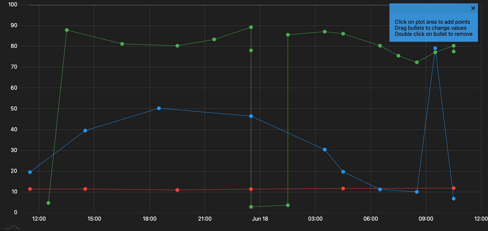

# Chart-That
Charting website that allows a user to quickly connect points together with a few mouse clicks. This is critical when attempting to describe a dataset that is impossible or hard to recreate with real data, but very easy to give a gist of what the plot looks like.

# Demo Site
https://aka.ms/chartthat

